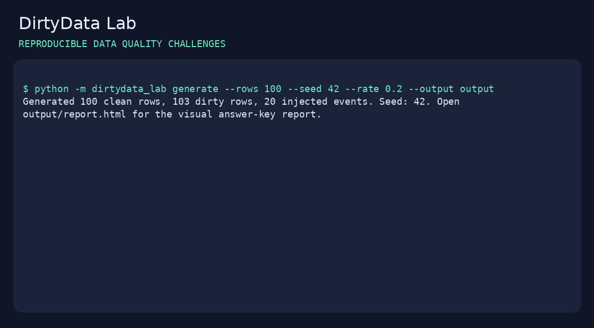

# DirtyData Lab

**Break data deliberately. Measure what your checks catch.**

Generate reproducible dirty CSV datasets, keep the exact answer key, and evaluate a data-quality detector by row, column and error type. Built for students, QA engineers and data developers who need test fixtures they can explain.

[Español](README.es.md) · [Example visual report](examples/customers/report.html) · [Contributing](CONTRIBUTING.md)

**Python 3.10+ · Zero runtime dependencies · MIT license · Runs locally**



## A useful example

Your validator catches missing values. But does it catch a duplicate business ID, a lost leading zero or an impossible date? DirtyData Lab injects known errors and tells you exactly what your validator missed, rather than relying on a vague quality score.

```bash
python -m dirtydata_lab generate --rows 100 --seed 42 --rate 0.2 --output output
python -m dirtydata_lab detect --input output/dirty.csv --contract output/contract.json --output output/predictions.json
python -m dirtydata_lab evaluate --truth output/ground_truth.json --predictions output/predictions.json --output output/evaluation.json
```

Example output:

```text
Generated 100 clean rows, 103 dirty rows, 20 injected events. Seed: 42.
Wrote 20 baseline detections to output/predictions.json.
Precision: 1.000 | Recall: 1.000 | F1: 1.000
```

The perfect result is a **smoke test of the bundled rules on their own synthetic taxonomy**, not evidence of generalization to real-world data. Plug in your own detector for a meaningful comparison.

## Install from source

```bash
git clone https://github.com/jairoequelal-ctrl/dirtydata-lab.git
cd dirtydata-lab
python -m venv .venv
# Windows PowerShell: .venv\Scripts\Activate.ps1
# macOS/Linux: source .venv/bin/activate
python -m pip install -e .
```

You can also run `python -m dirtydata_lab` directly from the repository without installing the package. This project is not published on PyPI.

## Eight corruption operators

| Error | What changes | Localization |
|---|---|---|
| `missing_value` | Required display name becomes empty | Name column |
| `duplicate_id` | Copy a record with an existing business ID | ID column of the appended occurrence |
| `invalid_date` | Set an impossible calendar date | Date column |
| `negative_amount` | Turn a nonnegative amount negative | Amount column |
| `invalid_category` | Introduce an out-of-contract category | `category` |
| `extra_whitespace` | Add surrounding spaces | Name column |
| `leading_zero_loss` | Remove initial zero from a fictional code | `postal_code` |
| `orphan_reference` | Replace a foreign key with an unknown parent | Parent ID column |

Business rules are specific to these fictional profiles. Negative values are not universally wrong: legitimate refunds, for example, need a different contract. Postal codes here are fictional five-digit identifiers, not country-specific postal validation.

## Profiles and configuration

```bash
python -m dirtydata_lab generate --profile products --rows 500 --seed 7 --rate 0.1 --output output/products
python -m dirtydata_lab generate --profile payments --rows 100 --seed 42 --errors invalid_date orphan_reference --output output/payments
```

Available profiles: `customers`, `products`, `payments`. Same schema roles, different business column names.

`--rate` sets the **event budget**: `floor(base_rows * rate)`. Events cycle through the selected error types in the supplied order, then mutate seed-selected rows. Small budgets may not include every selected type. Duplicates append rows, so the dirty dataset may have more rows than the clean dataset. This is not a corrupted-cell percentage. One clean row is reserved as a duplicate source; impossible nonduplicate budgets are rejected explicitly.

## Files you get

| File | Purpose |
|---|---|
| `clean.csv` | Original synthetic source |
| `dirty.csv` | Challenge input |
| `parents.csv` | Valid parent IDs |
| `contract.json` | Public schema and validation constraints |
| `ground_truth.json` | Hidden answer key, before/after evidence and file hashes |
| `starter_predictions.json` | Empty prediction template |
| `report.html` | Self-contained visual answer-key report; open locally |

Synthetic names and `example.invalid` emails are used. No personal data source or network call is needed. For honest evaluation, a detector should see `dirty.csv` and the public contract, **not** `clean.csv`, ground truth or the answer-key report.

## Evaluate your own detector

Write a JSON list using these exact fields:

```json
[
  {"row_id": "R000011", "column": "signup_date", "error_type": "invalid_date"}
]
```

The example shows the format; it is not a guaranteed correct detection for every seed. `row_id` is a unique benchmark locator, distinct from the business ID that may be duplicated. Preserve it when transforming or reordering data.

Scoring uses exact `(row_id, column, error_type)` tuples. A wrong column or wrong label counts as both a missed ground-truth event and a false-positive prediction. Repeated predictions are deduplicated, with raw and unique counts reported. Precision, recall and F1 are reported overall and per error type, together with false-positive and false-negative keys. Zero denominators produce 0, including empty challenges.

## Python API

```python
import json
from pathlib import Path
from dirtydata_lab import generate, detect, evaluate
from dirtydata_lab.core import read_csv

truth = generate("output", rows=100, seed=42, rate=0.2, profile="customers")
contract = json.loads(Path("output/contract.json").read_text())
predictions = detect(read_csv("output/dirty.csv"), contract)
result = evaluate(truth, predictions)
print(result["f1"])
```

## Tests and reproducibility

```bash
python -m unittest discover -s tests -v
```

Tests cover byte reproducibility, seed changes, clean-data validity, reversible mutations, all eight operators, exact scoring, duplicates and invalid inputs. CI is configured for Python 3.10–3.12.

Reproducibility means identical outputs for identical inputs with the same generator version/runtime. No timestamp is embedded in outputs. SHA-256 hashes identify generated source and contract files; the evaluator scores the supplied answer key and does not enforce those hashes automatically. Large-volume performance and cross-version byte identity are not guaranteed.

## Limits and next contributions

This first version generates three fixed schemas. It does not corrupt arbitrary uploaded CSVs, anonymize real data, train a model or automatically clean a dataset. The baseline covers the injected taxonomy and is not a general CSV validator. Data generation and scoring use memory proportional to input size.

Useful extensions: more realistic duplicate variants, custom schemas, independent SQL detectors, benchmark splits, streaming generation and adapters for common data-quality frameworks. See [CONTRIBUTING.md](CONTRIBUTING.md).

Created by **Jairo Quelal** as an open-source learning and testing tool. If it saves you time, a star helps others discover it.
